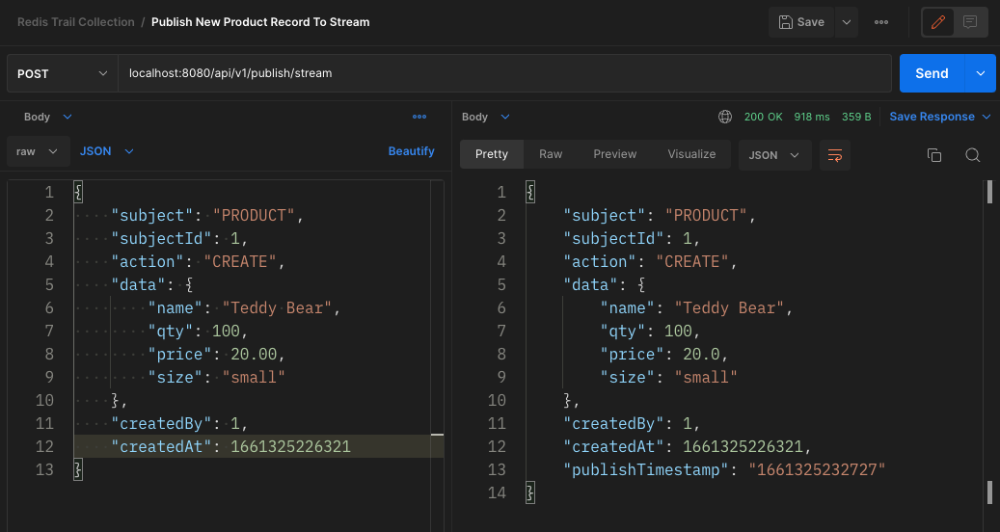
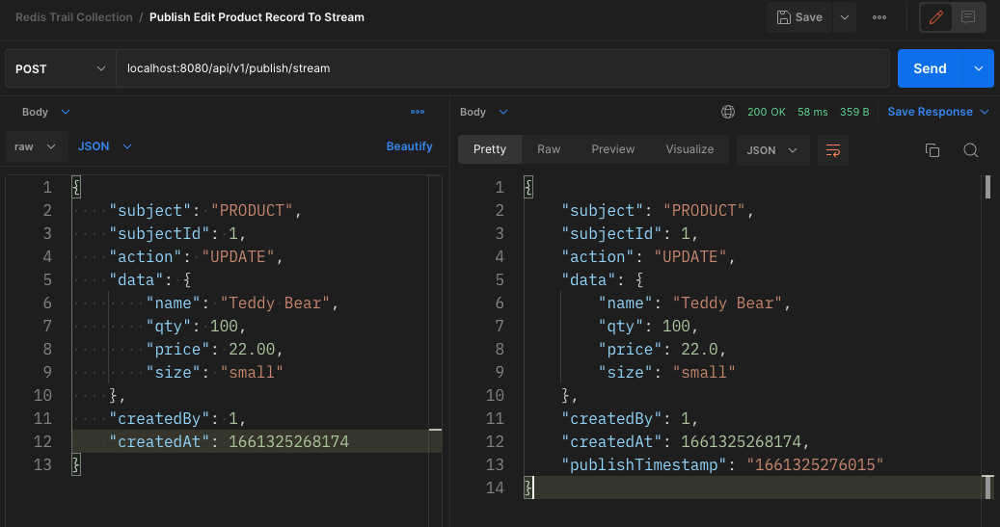
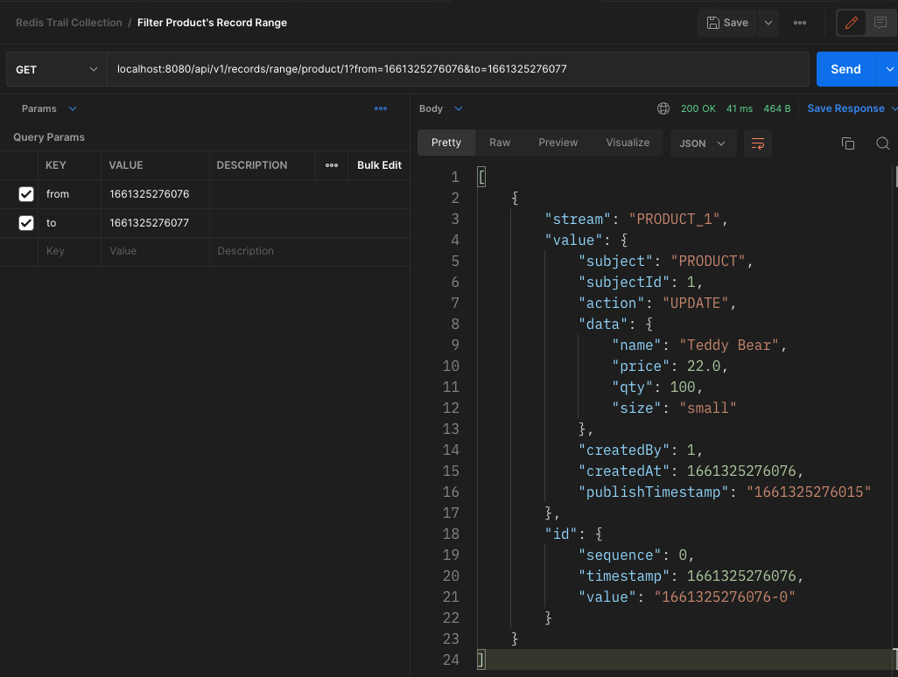
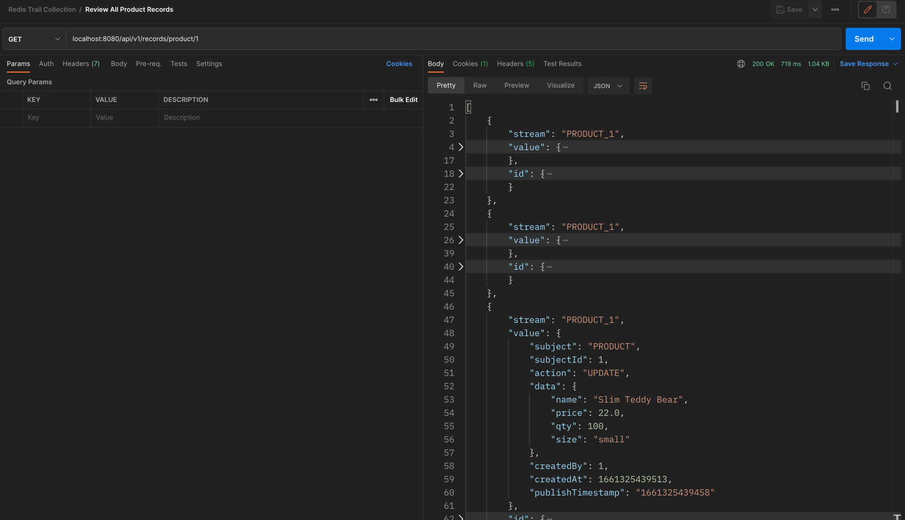
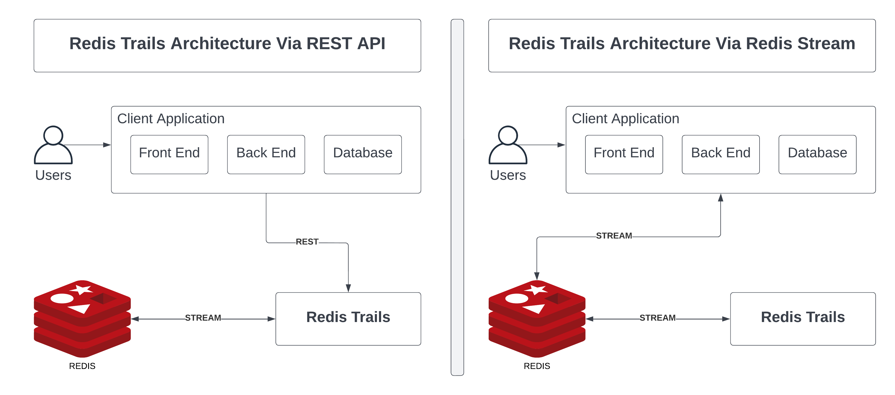
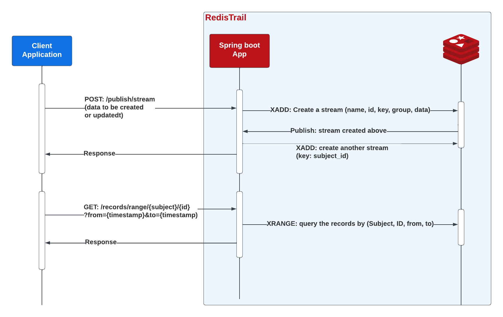

# Redis Trail

 An effective audit trail solution can be crucial to an organization's security and data integrity as it can help find the who, what, and when. This helps organizations keep track of changes and investigate potential mistakes or violations of policy. Redis Trail is built as an audit trail library using Redis Stack to allow any application to easily integrate for monitoring their data throughout their lifecycle, which is interfaced as ***Redis Stream***. It provides storage for the time-series data so that it can be queried easily and effectively through time.
<br>

***1. Publish New Product Record to Stream***


***2. Publish New Edited Product Record to Stream***


***3. Filter Product Record History By Timestamp***


***4. Fetch All Product's Change History***


# Overview video (Optional)

Here's a short video that explains the project and how it uses Redis:

[Insert your own video here, and remove the one below]

[](https://www.youtube.com/watch?v=vyxdC1qK4NE)

## Technical Stack

- Backend - Spring Boot, _Redis_
- Programming Language - Kotlin

## How it works

To illustrate how Redis Trail works, we have built it using Spring Boot framework which allow it get request as REST from any client application that wants to integrate. The showcase of application is mainly for product inventory, where we can create new product and update. And, our Redis Trail will record all the product update's history. So,  all the changes made on to the product will be stored in the Redis Trail via ***Redis Stream***, in which the client applications send REST request to Redis Trail, and the Redis Trail is the REST request receiver from client application. The data is stored with a date time stamp, which indicates when the change was made.
<br>
<br>
To simply put, we can query the change history of any product via subject and its subject id. The filter parameter will be ***from(timestamp)*** and ***to(timestamp)***, ***Redis Trail*** will fetch the products' record filter by timestamp range from and to.

### Architecture


### Internal Process Flow


### Record Schema
We will take product as example in the demo, below is the schema of the Product's Record of the application:
```kotlin
data class RecordEvent(
    var subject: String, // We will put "PRODUCT" as the example subject of record to audit
    val subjectId: Long, // Subject ID is the product's id in the client application that was called to Redis Trail to save.
    val action: String, // This can be defined by client application. We'd prefer "CREATE" or "UPDATE" as the action value.
    val data: Map<String, Any>, // The data of product
    val createdBy: Long, // The client application's user that makes change to the product record
    var createdAt: Long // The client application's timestamp that tell Redis Trail when that product data was made change.
)
```
Whenever a user makes any changes to the product data such as price, quantity, name, ..., etc. Client application will need to send request to Redis Trail via REST API or publish directly to redis stream.
<br>
Request Example
```json
{
    "subject": "PRODUCT",
    "subjectId": 1,
    "action": "UPDATE",
    "data": {
        "name": "Teddy Bear",
        "qty": 100,
        "price": 22.00,
        "size": "small"
    },
    "createdBy": 1,
    "createdAt": 1661325276076
}
```
Redis Trail is the publisher and consumer for stream key ***RECORD_EVENT*** and stream group ***RECORD_GROUP***. After receive data from redis stream, Redis Trail will publish another stream with key that combine by ***subject*** and ***subjectId*** if this is first make change to the subject and its subject id. For example: the new stream is ***PRODUCT_1***
<br>
<br>
So, the client application can fetch all or filter the product record history from Redis Trail via REST API. Redis Trail will filter the data from the new stream, for example ***PRODUCT_1***, and response back to client application.
<br>
Response Example:
```json
{
        "stream": "PRODUCT_1",
        "value": {
            "subject": "PRODUCT",
            "subjectId": 1,
            "action": "UPDATE",
            "data": {
                "name": "Teddy Bear",
                "price": 22.0,
                "qty": 100,
                "size": "small"
            },
            "createdBy": 1,
            "createdAt": 1661325276076,
            "publishTimestamp": "1661325276015"
        },
        "id": {
            "sequence": 0,
            "timestamp": 1661325276076,
            "value": "1661325276076-0"
        }
    }
```

### Initialization

The demo data is prepared using two operations: Create and Update.

**Create Product:**
```json
{
  "subject": "PRODUCT",
  "subjectId": 1,
  "action": "CREATE",
  "data": {
    "name": "Teddy Bear",
    "qty": 100,
    "price": 20.00,
    "size": "small"
  },
  "createdBy": 1,
  "createdAt": 1661325226321
}
```

**Update Product:**
```json
{
    "subject": "PRODUCT",
    "subjectId": 1,
    "action": "UPDATE",
    "data": {
        "name": "Teddy Bear",
        "qty": 100,
        "price": 22.00,
        "size": "small"
    },
    "createdBy": 1,
    "createdAt": 1661325276076
}
```

Redis is mainly used as the streaming data for the record event store from client application to Redis Trail.

### How the data is stored:

All the record change events, they are stored in redis stream. 
<br>
When Redis Trail application started up, it will create stream with key ***RECORD_EVENT*** with group ***RECORD_GROUP***.
When the client application send REST request to Redis Trail to publish the record change event to redis stream, then data is stored like: `XADD {stream_key} {timestamp}-0 {record_event_data}`
* For Example: `XADD RECORD_EVENT 1661400135369-0 {RECORD_EVENT_DATA}`
<p>
</p>

Redis Trail is the subscriber of the stream with key ***RECORD_EVENT***, when it receives the event from Redis Stream, Redis Trail will publish another new stream for the record change event which has key that is the combination of ***subject*** and ***subjectId*** of ***RECORD_EVENT_DATA***. Data is stored like: ```XADD {subject}_{subjectId} MAXLEN 100 {timestamp}-0 {data_of_subject}```
* For Example: `XADD PROUDCT_1 MAXLEN 100 1661400135369-0 {data_of_subject}`
  </br>

***Notice:*** `MAXLEN 100` indicate that every subject of id, Redis Trail can only store latest 100 change history records. 
### How the data is accessed:

The client application can send REST API requests to Redis Trail in order filter record event change history.
- To fetch all record event change history `XRANGE {stream_key} - +`
  - For Example: `XRANGE PRODUCT_1 - +`
- to filter specific timestamp range of the record event change `XRANGE {sream_key} {from_timestamp} {to_timestamp}`
  - For Example: `XRANGE PRODUCT_1 1661400135369 1661400135569`
  
## How to run it locally?

### Prerequisites

- Postman - v9.*
- JAVA - v11
- Docker - v19.03.13

### Local installation
Clone Redis Trail repository and go to `./redis-trails` folder(`cd ./redis-trails`) and then:
```shell
# Run Redis Stack in Local
docker-compose up -d

# Run Redis Trail
./gradlew bootRun
```

### Test Redis-Trail
Open Postman and Import `Redis Trail Collection.json`.
1. Create Subject Change Record: `POST - http://localhost:8080/api/v1/publish/stream`
2. Fetch Subject Change Record: `GET - http://localhost:8080/api/v1/records/{subject}/{subject_id}`


## Future of Redis Trail 
For future reference of Redis Trail, we will make it as Java library which client application can import and config to use in their business requirements. However, keep in mind that even if the Redis Trail in Java library, it still needs store/access data in Redis Stream.
<br>
<br>
The client applications don't have to send request to Redis Trail to save all change records. Using Redis Trail Java library, it can publish and consume data from Redis Stream directly.

***EOF!***
