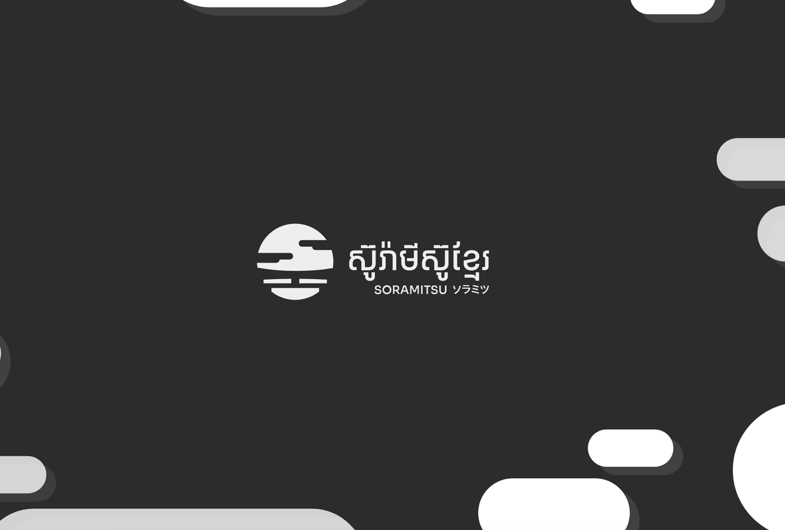

# Redis Trail

 An effective audit trail solution can be crucial to an organization's security and data integrity as it can help find the who, what, and when. This helps organizations keep track of changes and investigate potential mistakes or violations of policy. Redis Trail is built as an audit trail application using Spring Boot framework for the backend and Redis as stream storage. And, the client application can integrate with Redis Trail using RESTful API to keep and monitor track of change.
<br>

***1. Publish New Product Record to Stream***


***2. Publish New Edited Product Record to Stream***


***3. Filter Product Record History By Timestamp***


***4. Fetch All Product's Change History***


# Overview video (Optional)

Here's a short video that explains the project and how it uses Redis:

[](https://youtu.be/q-ouExtPMpQ)

## Technical Stack

- Backend - Spring Boot, _Redis_
- Programming Language - Kotlin

## How it works

To illustrate how Redis Trail works, we have built a simple client application that makes use of the APIs provided by Redis Trail. The application allows the user to create or update a product record, when the product is created or updated, the information is sent to Redis Trail by calling API provided by Redis trail. The change record is stored in the Redis as a stream with a date time stamp, and it can be accessed by the user through API provided by Redis Trail to monitor the changes of a specific ID of the product during a certain timestamp as required. 

Redis Trail creates a stream per product ID to persist the changes of each ID independently and thus makes it possible to identify exactly which user has done what changes on a specific product at a specified timestamp easily. Please refer to the Process Flow diagram for more details. 


### Architecture


### Internal Process Flow


### Record Schema
Below is the schema of the Product's Record of the client application. **Note:** the subject must follow the below convention, where it tells what is the subject, ID of the subject, action, author, and the metadata of the change so that we can tell what exactly is happening to our subject. And, the subject in the demo refers to **Product**.
```kotlin
data class RecordEvent(
    var subject: String, // We will put "PRODUCT" as the example subject of record to audit
    val subjectId: Long, // Subject ID is the product's id in the client application that was called to Redis Trail to save.
    val action: String, // This can be defined by client application. We'd prefer "CREATE" or "UPDATE" as the action value.
    val data: Map<String, Any>, // The data of product
    val createdBy: Long, // The client application's user that makes change to the product record
    var createdAt: Long // The client application's timestamp that tell Redis Trail when that product data was made change.
)
```
Whenever a user makes any changes to the product data such as price, quantity, name, ..., etc. The client application calls POST API provided by Redis Trail to keep records of change:
<br>
<br>
**Request Example**
```json
{
    "subject": "PRODUCT",
    "subjectId": 1,
    "action": "UPDATE",
    "data": {
        "name": "Teddy Bear",
        "qty": 100,
        "price": 22.00,
        "size": "small"
    },
    "createdBy": 1,
    "createdAt": 1661325276076
}
```
After receiving the request from the client application, Redis Trail converts the JSON request body to a stream in the Redis (key: **RECORD_EVENT**, group: **RECORD_GROUP**). And, Redis Trail itself is a subscriber of **RECORD_EVENT** and of the group  **RECORD_GROUP**. And thus, once the stream is created, the Redis Trail receives the event, and creates a new stream with a key that combines between subject and its ID in Redis, making it possible to retrieve all logs by its "subject_id" (e.g. PRODUCT_1) in a later stage via GET API :
<br>
<br>
**Response Example:**
```json
{
        "stream": "PRODUCT_1",
        "value": {
            "subject": "PRODUCT",
            "subjectId": 1,
            "action": "UPDATE",
            "data": {
                "name": "Teddy Bear",
                "price": 22.0,
                "qty": 100,
                "size": "small"
            },
            "createdBy": 1,
            "createdAt": 1661325276076,
            "publishTimestamp": "1661325276015"
        },
        "id": {
            "sequence": 0,
            "timestamp": 1661325276076,
            "value": "1661325276076-0"
        }
    }
```

### Initialization

The demo data is prepared using two operations: Create and Update.

**Create Product:**
```json
{
  "subject": "PRODUCT",
  "subjectId": 1,
  "action": "CREATE",
  "data": {
    "name": "Teddy Bear",
    "qty": 100,
    "price": 20.00,
    "size": "small"
  },
  "createdBy": 1,
  "createdAt": 1661325226321
}
```

**Update Product:**
```json
{
    "subject": "PRODUCT",
    "subjectId": 1,
    "action": "UPDATE",
    "data": {
        "name": "Teddy Bear",
        "qty": 100,
        "price": 22.00,
        "size": "small"
    },
    "createdBy": 1,
    "createdAt": 1661325276076
}
```

Redis is mainly used as the streaming data for the record event store from the client application to Redis Trail.
<br>
### How the data is stored:

All the record changes are stored in Redis as stream. 
<br>
<br>
When Redis Trail application starts up successfully, it creates a stream with key ***RECORD_EVENT*** with group ***RECORD_GROUP***.
When the client application sends POST request to Redis Trail, the RedisTrail app creates a stream in the Redis: `XADD {stream_key} {timestamp}-0 {record_event_data}`
* For Example: `XADD RECORD_EVENT 1661400135369-0 {RECORD_EVENT_DATA}`
<p>
</p>

Redis Trail itself is a subscriber of **RECORD_EVENT** and of the group  **RECORD_GROUP**. And thus, once the above stream is created, the Redis Trail receives the event, and creates a new stream with a key that combines between subject and its ID in Redis, making it possible to retrieve all logs by its "subject_id" (e.g. PRODUCT_1): ```XADD {subject}_{subjectId} MAXLEN 100 {timestamp}-0 {data_of_subject}```
* For Example: `XADD PROUDCT_1 MAXLEN 100 1661400135369-0 {data_of_subject}`
  </br>

***Notice:*** `MAXLEN 100` indicates that we can store the latest 100 change history records of one id per subject (e.g. PRODUCT_1), and the old data of that subject will be removed once the change history record reaches `MAXLEN`. The `MAXLEN` configuration can be configured dynamically in future enhancement, and the old data could be stored in a NOSQL database as a backup. This is an effective way to reduce the size and saves the cost of Redis storage.
### How the data is accessed:

The client application can send REST API requests to Redis Trail in order to retrieve the change history records of a specific product in a specific timestamp, and Redis Trail fetches the data from the Redis and responses back to the client:
- To fetch all record event change history `XRANGE {stream_key} - +`
  - For Example: `XRANGE PRODUCT_1 - +`
- To filter for a specific timestamp range `XRANGE {sream_key} {from_timestamp} {to_timestamp}`
  - For Example: `XRANGE PRODUCT_1 1661400135369 1661400135569`
  
## How to run it locally?

### Prerequisites

- Postman - v9.*
- JAVA - v11
- Docker - v19.03.13

### Local installation
Clone Redis Trail repository and go to `./redis-trails` folder(`cd ./redis-trails`) and then:
```shell
# Run Redis Stack in Local
docker-compose up -d

# Run Redis Trail
./gradlew bootRun
```

### Test Redis-Trail
Open Postman and Import `Redis Trail Collection.json`.
1. Create Subject Change Record: `POST - http://localhost:8080/api/v1/publish/stream`
2. Fetch Subject Change Record: `GET - http://localhost:8080/api/v1/records/{subject}/{subject_id}`


## Future of Redis Trail 
For future enhancement of Redis Trail, we are planning to make the backend a Java library, so that it can be easily integrated with the client application. 
<br>
<br>
We are also planning to build another communication layer for the client application to talk to Redis in the Redis Trail via Redis Pub/Sub directly.

## More Information about Redis Stack

Here some resources to help you quickly get started using Redis Stack. If you still have questions, feel free to ask them in the [Redis Discord](https://discord.gg/redis) or on [Twitter](https://twitter.com/redisinc).

### Getting Started

1. Sign up for a [free Redis Cloud account using this link](https://redis.info/try-free-dev-to) and use the [Redis Stack database in the cloud](https://developer.redis.com/create/rediscloud).
1. Based on the language/framework you want to use, you will find the following client libraries:
    - [Redis OM .NET (C#)](https://github.com/redis/redis-om-dotnet)
        - Watch this [getting started video](https://www.youtube.com/watch?v=ZHPXKrJCYNA)
        - Follow this [getting started guide](https://redis.io/docs/stack/get-started/tutorials/stack-dotnet/)
    - [Redis OM Node (JS)](https://github.com/redis/redis-om-node)
        - Watch this [getting started video](https://www.youtube.com/watch?v=KUfufrwpBkM)
        - Follow this [getting started guide](https://redis.io/docs/stack/get-started/tutorials/stack-node/)
    - [Redis OM Python](https://github.com/redis/redis-om-python)
        - Watch this [getting started video](https://www.youtube.com/watch?v=PPT1FElAS84)
        - Follow this [getting started guide](https://redis.io/docs/stack/get-started/tutorials/stack-python/)
    - [Redis OM Spring (Java)](https://github.com/redis/redis-om-spring)
        - Watch this [getting started video](https://www.youtube.com/watch?v=YhQX8pHy3hk)
        - Follow this [getting started guide](https://redis.io/docs/stack/get-started/tutorials/stack-spring/)

The above videos and guides should be enough to get you started in your desired language/framework. From there you can expand and develop your app. Use the resources below to help guide you further:

1. [Developer Hub](https://redis.info/devhub) - The main developer page for Redis, where you can find information on building using Redis with sample projects, guides, and tutorials.
1. [Redis Stack getting started page](https://redis.io/docs/stack/) - Lists all the Redis Stack features. From there you can find relevant docs and tutorials for all the capabilities of Redis Stack.
1. [Redis Rediscover](https://redis.com/rediscover/) - Provides use-cases for Redis as well as real-world examples and educational material
1. [RedisInsight - Desktop GUI tool](https://redis.info/redisinsight) - Use this to connect to Redis to visually see the data. It also has a CLI inside it that lets you send Redis CLI commands. It also has a profiler so you can see commands that are run on your Redis instance in real-time
1. Youtube Videos
    - [Official Redis Youtube channel](https://redis.info/youtube)
    - [Redis Stack videos](https://www.youtube.com/watch?v=LaiQFZ5bXaM&list=PL83Wfqi-zYZFIQyTMUU6X7rPW2kVV-Ppb) - Help you get started modeling data, using Redis OM, and exploring Redis Stack
    - [Redis Stack Real-Time Stock App](https://www.youtube.com/watch?v=mUNFvyrsl8Q) from Ahmad Bazzi
    - [Build a Fullstack Next.js app](https://www.youtube.com/watch?v=DOIWQddRD5M) with Fireship.io
    - [Microservices with Redis Course](https://www.youtube.com/watch?v=Cy9fAvsXGZA) by Scalable Scripts on freeCodeC
