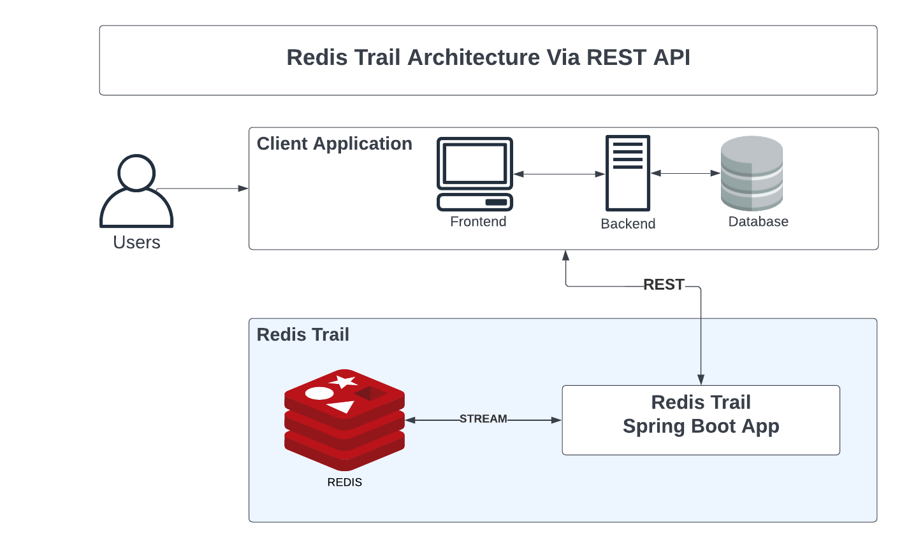

# RedisTrail

 An effective audit trail solution can be crucial to an organization's security and data integrity as it can help find the who, what, and when. This helps organizations keep track of changes and investigate potential mistakes or violations of policy. RedisTrail is built as an audit trail library using Redis Stack to allow any application to easily integrate for monitoring their data throughout their lifecycle, which is interfaced as ***Redis Stream***. It provides storage for the time-series data so that it can be queried easily and effectively through time.
<br>

***1. Publish New Product Record to Stream***


***2. Publish New Edited Product Record to Stream***


***3. Filter Product Record History By Timestamp***


# Overview video (Optional)

Here's a short video that explains the project and how it uses Redis:

[Insert your own video here, and remove the one below]

[](https://www.youtube.com/watch?v=vyxdC1qK4NE)

## Technical Stack

- Backend - Spring Boot, _Redis_
- Programming Language - Kotlin

## How it works

To illustrate how Redis Trails works, we have built it using Spring Boot framework which allow it get request as REST from any client application that wants to integrate. The showcase of application is mainly for product inventory, where we can create new product and update. And, our Redis Trails will record all the product update's history. So,  all the changes made on to the product will be stored in the Redis Trail via ***Redis Stream***, in which the client application is a publisher to redis stream or send REST request to Redis Trails, and the RedisTrail is the subscriber of redis stream or the rest request receiver from client application. The data is stored with a date time stamp, which indicates when the change was made.
<br>
<br>
To simply put, we can query the change history of any product via subject and its subject id. The filter parameter will be ***from(timestamp)*** and ***to(timestamp)***, ***Redis Trail*** will fetch the products' record filter by timestamp range from and to.

### Architecture


### Internal Process Flow
***Process Flow via REST from Client Application***


### Record Schema
We will take product as example in the demo, below is the schema of the Product's Record of the application:
```kotlin
data class RecordEvent(
    var subject: String, // We will put "PRODUCT" as the example subject of record to audit
    val subjectId: Long, // Subject ID is the product's id in the client application that was called to Redis Trails to save.
    val action: String, // This can be defined by client application. We'd prefer "CREATE" or "UPDATE" as the action value.
    val data: Map<String, Any>, // The data of product
    val createdBy: Long, // The client application's user that makes change to the product record
    var createdAt: Long // The client application's timestamp that tell Redis Trails when that product data was made change.
)
```
Whenever a user makes any changes to the product data such as price, quantity, name, ..., etc. Client application will need to send request to Redis Trails via REST API or publish directly to redis stream.
<br>
Request Example
```json
{
    "subject": "PRODUCT",
    "subjectId": 1,
    "action": "UPDATE",
    "data": {
        "name": "Teddy Bear",
        "qty": 100,
        "price": 22.00,
        "size": "small"
    },
    "createdBy": 1,
    "createdAt": 1661325276076
}
```
Redis Trails is the consumer for stream key ***RECORD_EVENT*** and stream group ***RECORD_GROUP***. After receive data from redis stream, Redis Trails will publish another stream with key that combine by ***subject*** and ***subjectId*** if this is first make change to the subject and its subject id. For example: the new stream is ***PRODUCT_1***
<br>
<br>
So, the client application can fetch all or filter the product record history from Redis Trails via REST API. Redis Trails will filter the data from the new stream, for example ***PRODUCT_1***, and response back to client application.
<br>
Response Example:
```json
{
        "stream": "PRODUCT_1",
        "value": {
            "subject": "PRODUCT",
            "subjectId": 1,
            "action": "UPDATE",
            "data": {
                "name": "Teddy Bear",
                "price": 22.0,
                "qty": 100,
                "size": "small"
            },
            "createdBy": 1,
            "createdAt": 1661325276076,
            "publishTimestamp": "1661325276015"
        },
        "id": {
            "sequence": 0,
            "timestamp": 1661325276076,
            "value": "1661325276076-0"
        }
    }
```

### Initialization

The demo data is prepared using two operations: Create and Update.

**Create Product:**
```json
{
  "subject": "PRODUCT",
  "subjectId": 1,
  "action": "CREATE",
  "data": {
    "name": "Teddy Bear",
    "qty": 100,
    "price": 20.00,
    "size": "small"
  },
  "createdBy": 1,
  "createdAt": 1661325226321
}
```

**Update Product:**
```json
{
    "subject": "PRODUCT",
    "subjectId": 1,
    "action": "UPDATE",
    "data": {
        "name": "Teddy Bear",
        "qty": 100,
        "price": 22.00,
        "size": "small"
    },
    "createdBy": 1,
    "createdAt": 1661325276076
}
```

Redis is mainly used as the streaming data for the record event store from client application to Redis Trails.

### How the data is stored:

Refer to [this example](https://github.com/redis-developer/basic-analytics-dashboard-redis-bitmaps-nodejs#how-the-data-is-stored) for a more detailed example of what you need for this section.

### How the data is accessed:

Refer to [this example](https://github.com/redis-developer/basic-analytics-dashboard-redis-bitmaps-nodejs#how-the-data-is-accessed) for a more detailed example of what you need for this section.


## How to run it locally?

[Make sure you test this with a fresh clone of your repo, these instructions will be used to judge your app.]

### Prerequisites

[Fill out with any prerequisites (e.g. Node, Docker, etc.). Specify minimum versions]

### Local installation

[Insert instructions for local installation]

## Deployment

To make deploys work, you need to create free account on [Redis Cloud](https://redis.info/try-free-dev-to)

### Google Cloud Run

[Insert Run on Google button](https://cloud.google.com/blog/products/serverless/introducing-cloud-run-button-click-to-deploy-your-git-repos-to-google-cloud)

### Heroku

[Insert Deploy on Heroku button](https://devcenter.heroku.com/articles/heroku-button)

### Netlify

[Insert Deploy on Netlify button](https://www.netlify.com/blog/2016/11/29/introducing-the-deploy-to-netlify-button/)

### Vercel

[Insert Deploy on Vercel button](https://vercel.com/docs/deploy-button)
